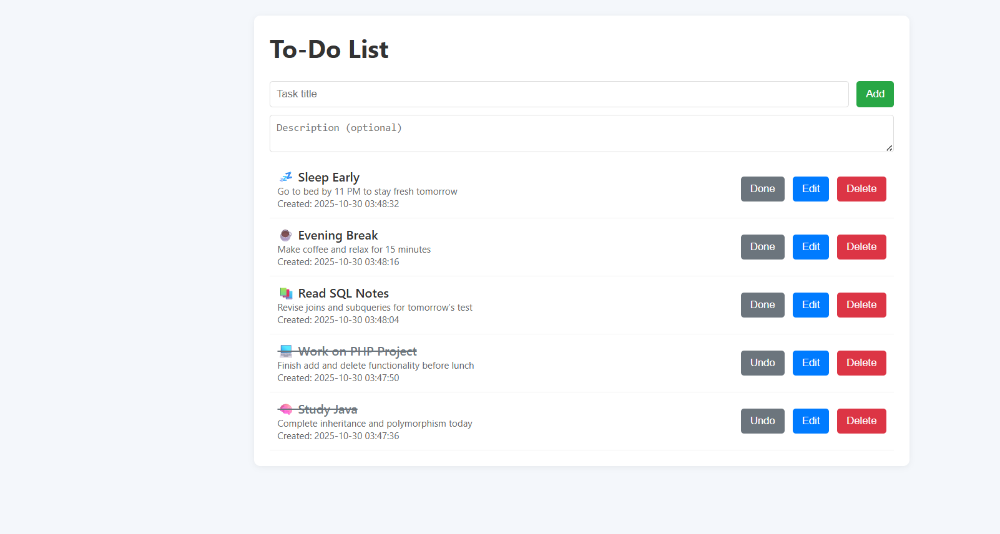

# 📝 PHP To-Do List  

A simple and elegant **To-Do List web app** built using **PHP**, **HTML5**, **CSS**, and **MySQL**.  
✅ Add, edit, delete and mark tasks as done — all with a clean, responsive UI.  

---

## 🚀 Features  
- ✨ Add new tasks with title & description  
- 🖋️ Edit existing tasks  
- ❌ Delete tasks  
- ✅ Mark tasks as completed  
- 🕓 Auto-timestamp for each entry  

---

## ⚙️ Setup Guide  
1. Move this folder to your **XAMPP → htdocs** directory.  
2. Open **phpMyAdmin** and create a database named `todo_project`.  
3. Run the following SQL query:
   ```sql
   CREATE TABLE tasks (
     id INT AUTO_INCREMENT PRIMARY KEY,
     title VARCHAR(255) NOT NULL,
     description TEXT,
     is_done TINYINT(1) DEFAULT 0,
     created_at TIMESTAMP DEFAULT CURRENT_TIMESTAMP,
     updated_at TIMESTAMP NULL ON UPDATE CURRENT_TIMESTAMP
   );

## 📘 Abstract
This project is a simple **To-Do List Application** designed to help users manage their daily tasks efficiently.  
It allows users to **add, edit, delete**, and **mark tasks as complete**.  
Built using **PHP** and **MySQL**, it demonstrates CRUD (Create, Read, Update, Delete) operations with an easy-to-use interface.

---

## 🎯 Objective
- To understand how CRUD operations work in PHP & MySQL
- To apply HTML5 and CSS3 in building dynamic web pages
- To create a beginner-friendly task management app

---

## 🧩 Introduction
The PHP To-Do List is a mini web project that focuses on database-driven task management.  
Users can add tasks with descriptions, edit them when needed, and mark tasks as done.  
This project is ideal for students learning **backend web development** and **database connectivity**.

---

## 🧠 Methodology
1. **Frontend:** HTML5, CSS3
2. **Backend:** PHP (Procedural)
3. **Database:** MySQL
4. **Server:** XAMPP (Apache + MySQL)

---

## 💻 Features <a name="features"></a>
- ✅ Add new tasks
- 🖋️ Edit existing tasks
- ❌ Delete tasks
- ☑️ Mark tasks as completed
- 🕓 Display task creation and update time
- 💾 Data stored in MySQL database

---

## 🗂️ Project Structure
````
todo_project/
│
├── assets/
│ ├── styles.css
│ └── screenshots/
│ ├── home.png
│ ├── add_task.png
│ ├── edit_task.png
│
├── add.php
├── delete.php
├── edit.php
├── db.php
├── toggle.php
├── update.php
├── index.php
└── README.md
````

## 🧰 Installation & Setup
1. Copy this folder to your **XAMPP → htdocs** directory  
2. Start **Apache** and **MySQL** from XAMPP Control Panel  
3. Create a database named `todo_project` in **phpMyAdmin**  
4. Run this SQL:
   ````
   CREATE TABLE tasks (
     id INT AUTO_INCREMENT PRIMARY KEY,
     title VARCHAR(255) NOT NULL,
     description TEXT,
     is_done TINYINT(1) DEFAULT 0,
     created_at TIMESTAMP DEFAULT CURRENT_TIMESTAMP,
     updated_at TIMESTAMP NULL ON UPDATE CURRENT_TIMESTAMP
   );
```
Open your browser and go to
👉 http://localhost/todo_project/

🪄 Usage <a name="usage"></a>

Type a new task name and click Add Task

Edit any task using the Edit button

Delete tasks permanently using the Delete button

Mark tasks as completed using the Done checkbox

```
---
## 🏠 Homepage
| Homepage |
|:--:|
| 

---


## 🧑‍💻 Author
👨‍💻 Saumik Laha

📧 Email: saumiklaha@gmail.com

---


## 🏁 Conclusion
This PHP-based To-Do List demonstrates the power of CRUD operations and dynamic content management using MySQL.
It is a great starter project for beginners exploring backend web development.

---

## ⚖️ License

This project was developed as part of the **Full Stack Web Development Internship** offered by **1Stop.ai**.  
It is recognized as **Backend Project - 1** under the internship training module.

🧑‍💻 **Intern Name:** Saumik Laha  
📧 **Email:** saumiklaha@gmail.com   
📚 **Domain:** PHP To-Do List Application (Backend Project)

Copyright © 2025  
This project is licensed for educational and internship purposes only.  
Unauthorized commercial use or redistribution is prohibited.

---
